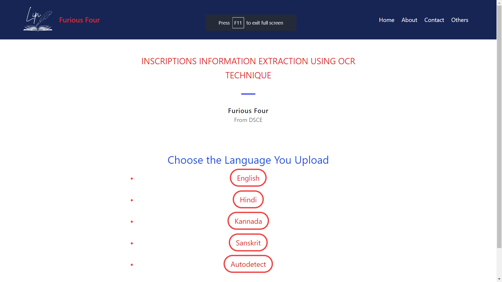
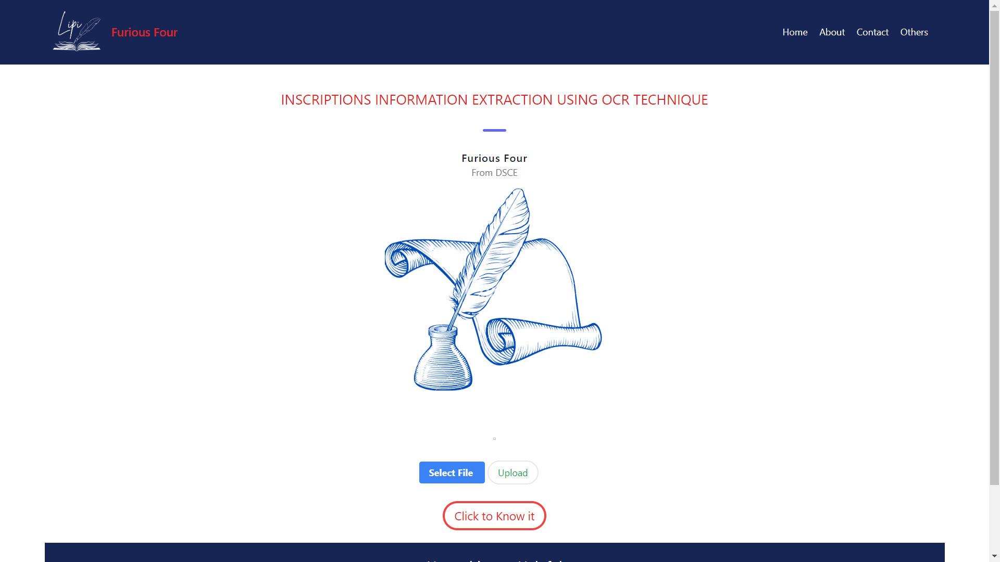

# Lipi

Lipi is a Application where a user can upload the photos of a various scripts of different languages (typed, hand-written or manuscripts), and it extracts the text from the script; Also user can translate into various other languages.


## Features

- Text Extraction from image
- Various languages are available
- Obtained text can be translated into other languages


## Tech stack

- Node.js
- Express.js
- MongoDB
- 'ejs' templating engine(for dynamic data transfer)
- Tessaract (for OCR - Optical Charecter Recognition)
- Google Translator (for transalting languages)
## Setup Instructions

Here 2 backend frameworks Express.js and Flask(Python) are used.

1. Clone the repository:
   ```bash
   git clone https://github.com/punith-kumar-pr/Extraction-and-translation-of-text-from-scripts
    ``` 

2. Navigate to the project directory:

    ```bash
    cd Extraction-and-translation-of-text-from-scripts
    ```
   
3. Install dependencies for application

   ```bash
   npm install
   ```

4. Set up environment variables and other variables:

    ```bash
    PORT = 3000
    DB_URI = your_mongodb_connection_string
    ```    

5. Start the server:

    ```bash
    node app.js
    ```
  
    Start the Flask server for language translation
    (this is used because google translate api is free in python)

    ```bash
    cd 'python route'
    python app.py
    ```
    by default it uses PORT:5000

7. Open your browser and navigate to http://localhost:3000 to access the application.


    
## Screenshots






##
#### Don't forget to give a star if you like it

## Thank you
